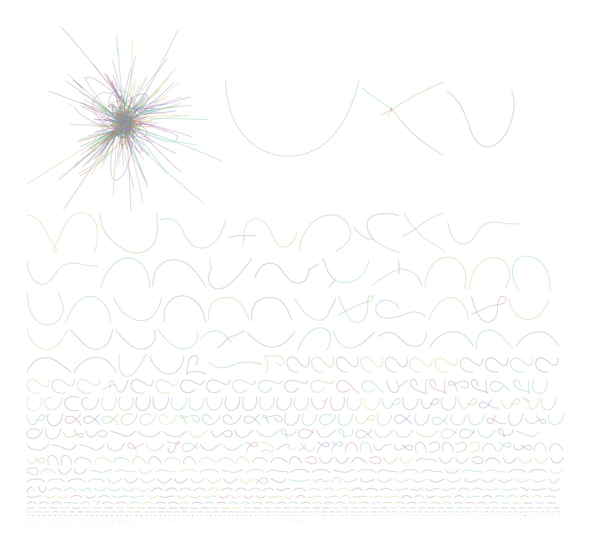
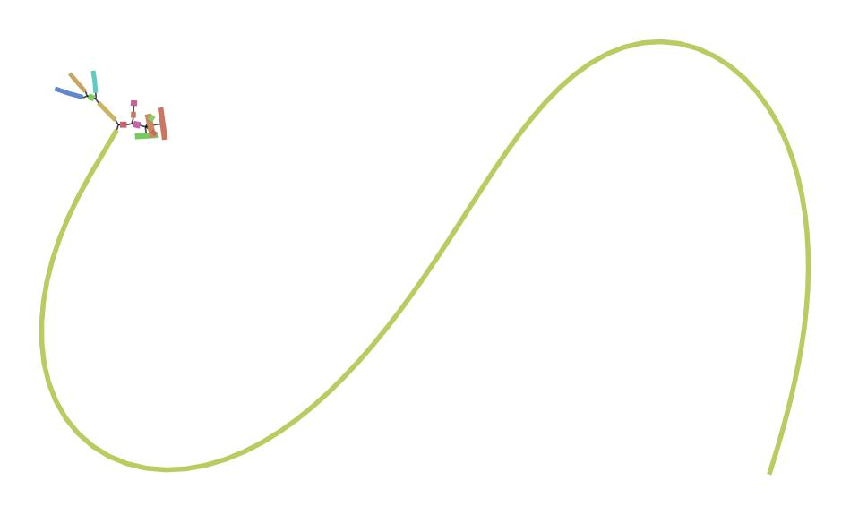
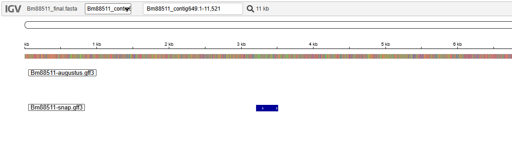
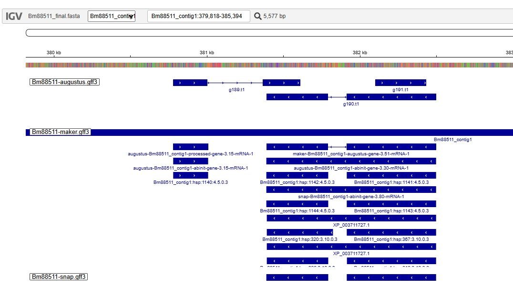
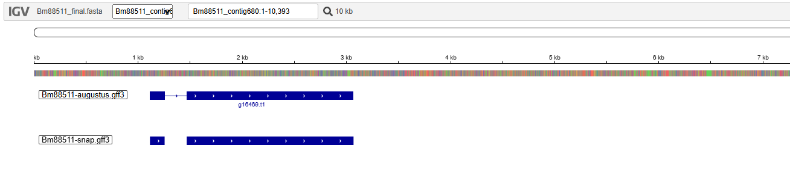
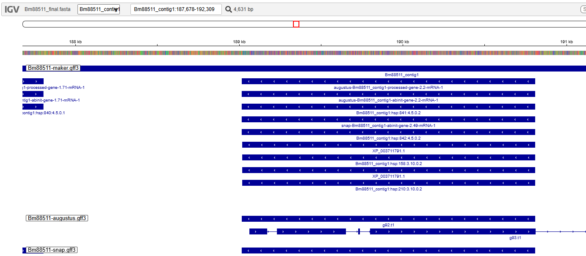

# 🧬 MyGenome  
Whole-Genome Assembly of *Pyricularia oryzae* Isolate **Bm88511**

This repository documents the complete genome assembly workflow for isolate **Bm88511**, from NCBI metadata submission through quality control, trimming, assembly optimization, graph visualization, and final assembly selection.

---

# 📚 Table of Contents

1. [Project Overview](#project-overview)  
2. [NCBI Submissions](#ncbi-submissions)  
3. [Data Retrieval](#data-retrieval)  
4. [Raw Data Information](#raw-data-information)  
5. [Quality Control (FastQC)](#quality-control-fastqc)  
6. [Read Trimming (Trimmomatic)](#read-trimming-trimmomatic)  
7. [Genome Assembly with VelvetOptimizer](#genome-assembly-with-velvetoptimizer)  
8. [Genome Assembly with SPAdes (Selected)](#genome-assembly-with-spades-selected)  
9. [Assembly Comparison and Selection](#assembly-comparison-and-selection)  
10. [Genome Visualization with Bandage](#genome-visualization-with-bandage)  
11. [Final Assembly Files](#final-assembly-files)
12. [BUSCO Assessment](#busco-assessment)
13. [Mitochondrial Contig Identification](#mitochondrial-contig-identification)
14. [Gene Prediction Analysis (SNAP vs AUGUSTUS)](#gene-prediction-analysis-snap-vs-augustus)
15. [BLAST Analysis: Bm88511 vs B71 Reference](#blast-analysis-bm88511-vs-b71-reference)
16. [Predicting Bm88511 Proteins](#predicting-bm88511-proteins)
17. [Using RNAseq Data to Confirm Gene Predictions](#using-rnaseq-data-to-confirm-gene-prediction)

---

# Project Overview

- **Researcher:** Gabriel Chitolina  
- **Organism:** *Pyricularia oryzae*  
- **Isolate:** Bm88511  
- **Host:** *Urochloa mutica*  
- **Collection Location:** Philippines: Nueva Ecija  
- **Collection Year:** 1988  
- **Sequencing Platform:** Illumina NovaSeq X  
- **Library Layout:** Paired-end  
- **Library Preparation:** Twist Library Preparation EF2.0  

**VM username:** gde267@gde267.cs.uky.edu  
**MCC username:** gde267@mcc.uky.edu  

**Objective:** Generate and optimize a high-quality genome assembly

---

# Data Retrieval

Raw sequencing data were retrieved from Dr. Mark Farman's personal computer and transferred to the local working environment using secure copy (SCP).

```bash
scp -r ngs@10.163.188.11:~/Desktop/Bm88511 ~/sequences
```

This command recursively copies the directory Bm88511 from the remote machine (10.163.188.11) to the local directory ~/sequences.

-r: Recursively transfers all files and subdirectories
Source: Dr. Mark Farman's personal computer (user: ngs)
Destination: Local working directory (~/sequences)

The transferred directory contained the raw paired-end FASTQ files used for downstream analysis.

---

# NCBI Submissions

## BioSample Submission

- **BioProject:** PRJNA926786  
- **BioSample:** SAMN55064733  

Metadata submitted using the MIGS Eukaryotic: plant-associated package.

## Sequence Read Archive (SRA)

- **SRA Accession:** SRR37270005  
- **Release Date:** 12/31/2026  

Raw paired-end FASTQ files:

#### Bm88511_1.fq.gz  
#### Bm88511_2.fq.gz

---

# Raw Data Information

- Raw reads (single-end): **4,306,107**  
- Cleaned paired reads used for assembly: **3,638,894**  
- Total bases (cleaned R1 + R2): **1,087,853,572 bp**  
- Estimated genome size: **~40 Mb**

---

# Quality Control (FastQC)

Quality control was performed on the VM using FastQC.

## Raw Data

### FastQC Commands

Raw read quality assessment:

```bash
fastqc Bm88511/Bm88511_1.fq.gz Bm88511/Bm88511_2.fq.gz -o ~/sequences
```

### Summary of Warnings and Errors

Raw reads showed:
- Adapter contamination  
- Elevated duplication levels  
- Minor per-base sequence quality warnings  

### Raw Data Images

<details>
  <summary><strong>Read 1</strong></summary>

    
  

</details>

<details>
  <summary><strong>Read 2</strong></summary>

    
  

</details>

### Full FastQC Reports (Raw Data) Download

- [Read 1 HTML Report](data/Bm88511_1_fastqc.html)  
- [Read 2 HTML Report](data/Bm88511_2_fastqc.html)

---

# Read Trimming (Trimmomatic)

Reads were trimmed using Trimmomatic v0.38:

```bash
java -jar trimmomatic-0.38.jar PE -threads 2 -phred33 \
-trimlog Bm88511_errorlog.txt \
Bm88511_1.fq.gz Bm88511_2.fq.gz \
Bm88511_1_paired.fastq Bm88511_1_unpaired.fastq \
Bm88511_2_paired.fastq Bm88511_2_unpaired.fastq \
ILLUMINACLIP:adaptors.fa:2:30:10 \
SLIDINGWINDOW:20:20 MINLEN:125
```

Only paired reads were used for downstream assembly.

---

## Trimmed Data FastQC

Post-trimming quality assessment:

```bash
fastqc Bm88511_1_paired.fastq Bm88511_2_paired.fastq
```

## Summary After Trimming

- Adapter contamination removed  
- Overall sequence quality improved  
- Minor warnings remained but acceptable for assembly  

<details>
  <summary><strong>Trimmed Paired Reads (Used for Assembly)</strong></summary>

    
  

</details>

<details>
  <summary><strong>Trimmed Unpaired Reads</strong></summary>

    
  

</details>

### Full FastQC Reports (Trimmed Data) Download

- [Trimmed R1 Paired](data/Bm88511_1_paired_fastqc.html)  
- [Trimmed R2 Paired](data/Bm88511_2_paired_fastqc.html)  
- [Trimmed R1 Unpaired](data/Bm88511_1_unpaired_fastqc.html)  
- [Trimmed R2 Unpaired](data/Bm88511_2_unpaired_fastqc.html)  

---

# Genome Assembly with VelvetOptimizer

Velvet assemblies were generated first using VelvetOptimizer to explore k-mer performance.

## Round 1 Optimization (Step = 10)

```bash
sbatch velvetoptimiser.sh Bm88511 39 79 10
```

Results:

- Genome Size: 41,616,069 bp  
- Contigs: 9,046  
- N50: 14,242 bp  

## Round 2 Optimization (Step = 2)

```bash
sbatch velvetoptimiser.sh Bm88511 69 89 2
```

Results:

- Genome Size: 41,611,510 bp  
- Contigs: 9,025  
- N50: 14,187 bp  

Velvet assemblies were fragmented and exhibited relatively low N50 values.

---

# Genome Assembly with SPAdes (Selected)

SPAdes was used for comparison using multi-k-mer assembly and built-in error correction.

```bash
sbatch spades.sh Bm88511
```

SPAdes uses multiple k-mers (21, 33, 55, 77).

## Final SPAdes Assembly Metrics
<div align="center">
<table>
  <tr><th>Metric</th><th>Value</th></tr>
  <tr><td>Genome Size</td><td>41,509,816 bp</td></tr>
  <tr><td>Number of Contigs</td><td>6,482</td></tr>
  <tr><td>N50</td><td>77,767 bp</td></tr>
</table>

</div>

---

# Assembly Comparison and Selection

<div align="center">

| Assembler | Genome Size | Contigs | N50 |
|-----------|-------------|---------|------|
| Velvet (Step 10) | 41,616,069 | 9,046 | 14,242 |
| Velvet (Step 2)  | 41,611,510 | 9,025 | 14,187 |
| **SPAdes** | **41,509,816** | **6,482** | **77,767** |

</div>

### Final Selection

SPAdes was selected because it:

- Increased N50 by more than 5-fold  
- Reduced contig count substantially  
- Improved overall assembly contiguity  

---

# Genome Visualization with Bandage

The SPAdes assembly graph (`assembly_graph.fastg`) was visualized using Bandage.

<details>
  <summary>Whole Assembly Graph</summary>

  

</details>

<details>
  <summary>Single Contig + Scope = 4 (Node 119964)</summary>

  

</details>


The whole graph shows a  interconnected cluster.

The zoomed node (scope = 4) reveals local connectivity and confirms contig extension without excessive branching.

---

# Final Assembly Files

Bm88511_final.fasta  

---

# BUSCO Assessment

**Run details:**
- **BUSCO version:** 5.7.0  
- **Lineage dataset:** ascomycota_odb10 (n = 1706 BUSCOs)  
- **Mode:** euk_genome_min  
- **Gene predictor:** miniprot  

### Completeness Metrics
- **Complete (C):** 98.6%  
  - **Single-copy (S):** 98.4%  
  - **Duplicated (D):** 0.2%  
- **Fragmented (F):** 0.2%  
- **Missing (M):** 1.2%  
- **Total BUSCO groups (n):** 1706  
- **Error rate (E):** 3.5%  

### BUSCO Counts
- **Complete BUSCOs:** 1683  
  - Complete and single-copy: 1679  
  - Complete and duplicated: 4  
- **Fragmented BUSCOs:** 3  
- **Missing BUSCOs:** 20  
- **BUSCOs with internal stop codons:** 59  

### Assembly Statistics
- **Number of scaffolds:** 3,595  
- **Number of contigs:** 3,676  
- **Total assembly length:** 41,129,872 bp  
- **Percent gaps:** 0.016%  
- **Scaffold N50:** 75 KB  
- **Contig N50:** 69 KB  

### Interpretation
This assembly shows very high completeness (98.6%) with minimal duplication (0.2%) and very few missing genes (1.2%), indicating a high-quality genome assembly.

---

# Mitochondrial Contig Identification

We need to determine which contigs in the genome assembly correspond to the mitochondrial genome before submission to NCBI.

## Step 1: Retrieve Mitochondrial Reference Sequence

Copy the mitochondrial reference sequence:

```bash
cp /project/farman_s26cs480/RESOURCES/MoMitochondrion.fasta .
```

## Step 2: Run BLAST Against Genome Assembly

Run blastn using Singularity on MCC with output format 6 and selected columns:

```bash
singularity run --app blast2120 /share/singularity/images/ccs/conda/amd-conda1-centos8.sinf \
blastn -query MoMitochondrion.fasta \
-subject MyGenome_final.fasta \
-evalue 1e-50 \
-max_target_seqs 20000 \
-outfmt '6 qseqid sseqid slen length qstart qend sstart send btop' \
-out MoMitochondrion.Bm88511.BLAST
```

## Step 3: Identify Mitochondrial Contigs

Extract contigs where ≥90% of their length aligns to the mitochondrial reference:
```bash
awk '$4/$3 >= 0.9 {print $2 ",mitochondrion"}' MoMitochondrion.Bm88511.BLAST > Bm88511_mitochondrion.csv
```

This .csv file will be uploaded to NCBI to indicate mitochondrial contigs.

## Step 4: Export Short/Partial Hits

Export BLAST results that do not meet the ≥90% threshold:
```bash
awk '$4/$3 < 0.9' MoMitochondrion.Bm88511.BLAST > Bm88511_short_mitochondrial_hits.txt
```
## Step 5: Manual Inspection

The file `Bm88511_short_mitochondrial_hits.txt` was manually inspected to identify contigs with **split alignments** that may together cover ≥90% of the contig.

### Output

```bash
MoMito.70-15    Bm88511_contig675       10597   6671    28202   34865   1       6662    ...
MoMito.70-15    Bm88511_contig675       10597   3941    1       3933    6663    10597   ...
MoMito.70-15    Bm88511_contig624       12582   4608    20973   25571   5200    9804    ...
MoMito.70-15    Bm88511_contig624       12582   3972    15859   19830   23      3994    ...
MoMito.70-15    Bm88511_contig624       12582   2671    25608   28278   9913    12582   ...
MoMito.70-15    Bm88511_contig624       12582   1143    19838   20968   4095    5236    ...
MoMito.70-15    Bm88511_contig704       9221    276     10497   10749   9221    8946    ...
```

Identified mitochondrial contigs that did not meet the ≥90% threshold were manually added to the Bm88511_mitochondrion.csv file.

### Output Files

- [BLAST output](data/MoMitochondrion.Bm88511.BLAST)
- [Short mitochondrial hits](data/Bm88511_short_mitochondrial_hits.txt)
- [Final mitochondrial contigs CSV](data/Bm88511_mitochondrion.csv)

---

# Gene Prediction Analysis (SNAP vs AUGUSTUS)

## Methods

### SNAP

Training SNAP required generating a species-specific HMM using annotations from a related genome.

#### Start screen session
```bash
screen -S genes bash -l
```

#### Navigate to working directory
```bash
cd ~/genes/snap
```

#### Prepare training data
```bash
echo '##FASTA' | cat B71Ref2_a0.3.gff3 - B71Ref2.fasta > B71Ref2.gff3
```

#### Convert to SNAP ZFF format
```bash
maker2zff B71Ref2.gff3
```

#### Evaluate annotation statistics
```bash
fathom genome.ann genome.dna -gene-stats
```

#### Categorize gene models
```bash
fathom genome.ann genome.dna -categorize 1000
```

#### Extract high-quality gene set
```bash
fathom uni.ann uni.dna -gene-stats
```

#### Export sequences for training
```bash
fathom uni.ann uni.dna -export 1000 -plus
```

#### Train model
```bash
forge export.ann export.dna
```

#### Assemble HMM
```bash
hmm-assembler.pl Moryzae . > Moryzae.hmm
```

### Gene prediction with SNAP:

#### Run SNAP gene prediction
```bash
snap-hmm Moryzae.hmm Bm88511.fasta > Bm88511-snap.zff
```

#### Generate statistics
```bash
fathom Bm88511-snap.zff Bm88511.fasta -gene-stats
```

#### Convert to GFF2
```bash
snap-hmm Moryzae.hmm Bm88511.fasta -gff > Bm88511-snap.gff2
```

---

### AUGUSTUS
AUGUSTUS was run using a pre-trained model for a closely related species.

#### Navigate to working directory
```bash
cd ~/genes/augustus
```

#### Run AUGUSTUS gene prediction
```bash
augustus --species=magnaporthe_grisea --gff3=on \
--singlestrand=true --progress=true \
Bm88511_final.fasta > Bm88511-augustus.gff3
```

## Results

### Predicted Gene Counts

<div align="center">

| Tool      | Number of Predicted Genes |
|-----------|---------------------------|
| SNAP      | 12,517                    |
| AUGUSTUS  | 17,487                    |
| MAKER     | 12,934                    |

</div>

---

### How counts were obtained

**SNAP**
```bash
awk '{print $9}' Bm88511-snap.gff2 | sort | uniq | wc -l
```

Output: 12,517

**MAKER**
```bash
awk -F'\t' '$3 == "gene" {count++} END {print count}' Bm88511-maker.gff3

Output: 12934
```

**AUGUSTUS**
```bash
grep "^# start gene" Bm88511-augustus.gff3 | wc -l

Output:17487
```

### IGV Visualization

<details>
  <summary><strong>SNAP-only Gene Prediction</strong></summary>

  

</details>

<details>
  <summary><strong>AUGUSTUS-only Gene Prediction</strong></summary>

  

</details>

<details>
  <summary><strong>Same Exon/Intron Structure (SNAP vs AUGUSTUS)</strong></summary>

  

</details>

<details>
  <summary><strong>Different Exon/Intron Structure (SNAP vs AUGUSTUS)</strong></summary>

  <!-- Add image here if you have one -->
  <!--  -->

</details>

<details>
  <summary><strong>Gene predicted by SNAP, AUGUSTUS, and MAKER</strong></summary>

  

</details>


#### Notes
SNAP predictions are based on a trained HMM specific to *M. oryzae*.
AUGUSTUS uses a generalized HMM with species-specific parameters (magnaporthe_grisea).
SNAP outputs simpler exon-based annotations, while AUGUSTUS provides more detailed gene structures including CDS and protein sequences.

---

# BLAST Analysis: Bm88511 vs B71 Reference

## BLAST Search Setup

A nucleotide BLAST search was performed to compare the Pyricularia oryzae Bm88511 assembly (MyGenome) against the B71v2sh reference genome.

The following command was used:

```bash
blastn -query B71.fasta -subject MyGenomeID_final.fasta -evalue 1e-100 -outfmt 7 > B71.MyGenomeID.BLAST
```

### Output file generated
[Bm88511 BLAST x B71](data/B71.Bm88511.BLAST)

This search identifies high-confidence alignments between the reference genome (query) and the assembled genome (subject), allowing detection of shared and missing genomic regions.

---

## Contigs with no matches to B71
To identify contigs in the Bm88511 genome assembly that do not match the B71 reference genome, a BLASTN search was performed using an inverted query/subject setup. In this configuration, Bm88511 (MyGenome) is used as the query and B71 is used as the subject. This allows each contig in the assembly to be evaluated independently against the reference genome.

### BLAST search (inverted setup)
```bash
blastn -query MyGenomeID_final.fasta -subject B71.fasta -evalue 1e-100 -outfmt 7 > inverted.B71.Bm88511.BLAST
```

This orientation ensures that each contig from the Bm88511 assembly is treated as a query, allowing direct identification of contigs that fail to produce any alignments.

### Output file generated
[B71 BLAST x Bm88511](data/inverted.B71.Bm88511.BLAST)

In the BLAST output, contigs with no detectable similarity to the reference are explicitly reported as:
```bash
# 0 hits found
```

Each occurrence of this line corresponds to a contig that does not align to the B71 genome.

### Code used to count no-hit contigs
```bash
grep -c "# 0 hits found" inverted.B71.Bm88511.BLAST
```

This command counts the number of contigs in the BLAST output that had no alignments to the B71 reference genome. Each “0 hits found” entry represents one contig unique to the Bm88511 assembly or lacking detectable homology in B71.

---

## List of unmatched Bm88511 contigs

Contigs in the Bm88511 assembly with no detectable alignment to the B71 reference genome were identified directly from the BLAST output. The BLAST file explicitly labels queries with no alignments as “0 hits found,” allowing direct extraction of unmatched contigs

### Command used to extract no-hit contigs
```bash
awk '
/^# Query:/ {contig=$3}
/# 0 hits found/ {print contig}
' inverted.B71.Bm88511.BLAST > no_hit_contigs.txt
```

### Output file generated
[Unmatched Bm88511 contigs](data/no_hit_contigs.txt)

This file contains the list of Bm88511 contigs that did not produce any significant alignment to the B71 reference genome. These contigs likely represent isolate-specific sequences, highly diverged regions, or unaligned assembly fragments.

---

## Missing regions in MyGenome relative to B71

Large genomic regions present in B71 but absent in MyGenome were identified by examining:

- Gaps in alignment coverage
- Regions of B71 lacking any high-confidence hits

These regions may indicate:

- Structural variation
- Assembly fragmentation
- True biological differences between isolates

---

## Conversion of BLAST output to GFF3

To visualize alignments in IGV, BLAST output was converted into GFF3 format using an awk script that maps BLAST tabular fields to genome annotation features. The resulting file was used as an alignment track in IGV for comparative genome analysis between the Bm88511 assembly and the B71 reference genome.

The mapping of BLAST columns to GFF3 fields was as follows:

Query/Subject IDs → sequence identifiers
Alignment start/end → feature coordinates
Bit score → score field
Percent identity and e-value → stored in attributes

The script also determines strand orientation based on coordinate order and assigns unique IDs to each alignment and HSP.

### BLAST to GFF3 Conversion Script

```bash
awk 'BEGIN {OFS="\t"}
!/^#/ {
  strand = ($7 <= $8) ? "+" : "-"
  start = ($7 <= $8) ? $7 : $8
  end   = ($7 <= $8) ? $8 : $7

  match_id = "blast_hit_" NR
  hsp_id   = "blast_hsp_" NR

  print $1, "BLAST", "match", start, end, $12, strand, ".",
        "ID="match_id";Name="$2";Target="$2" "$9" "$10";evalue="$11";pident="$3

  print $1, "BLAST", "match_part", start, end, $12, strand, ".",
        "ID="hsp_id";Parent="match_id";Target="$2" "$9" "$10" "strand
}' B71.Bm88511.BLAST > blast-B71-Bm88511.gff3
```

---

## IGV Visualization

The B71 reference genome and converted GFF3 alignment track were loaded into IGV.

Chromosome-level inspection was performed to:

- Identify regions with no MyGenome alignment
- Detect structural variation
- Assess genome completeness and synteny

<details>
  <summary><strong>B71 Gaps in Bm88511</strong></summary>

  

</details>

---

# Predicting Bm88511 Proteins

Protein prediction was performed using MAKER by merging annotation outputs into final protein and transcript FASTA files.

### MAKER protein merge command
```bash
singularity exec /share/singularity/images/ccs/MAKER/amd-maker-debian10.sinf fasta_merge \
-d Bm88511_final.maker.output/Bm88511_final_master_datastore_index.log \
-o Bm88511
```

This command consolidates all MAKER annotation evidence into final genome-wide protein predictions.

---

## Protein files generated

The following FASTA files were produced:

### MAKER proteins (final):
[Maker Proteins](/data/Bm88511.all.maker.proteins.fasta)

### AUGUSTUS proteins:
[AUGUSTUS proteins](/data/Bm88511.all.maker.augustus.proteins.fasta)

### SNAP proteins:
[SNAP proteins](/data/Bm88511.all.maker.snap.proteins.fasta)

---

## Counting predicted proteins

Protein counts were obtained by counting FASTA headers (> entries):

### MAKER proteins
```bash
grep -c "^>" Bm88511.all.maker.proteins.fasta
```

**Result:** 12,934 proteins

### AUGUSTUS proteins
```bash
grep -c "^>" Bm88511.all.maker.augustus.proteins.fasta
```

**Result:** 11,054 proteins

### SNAP proteins
```bash
grep -c "^>" Bm88511.all.maker.snap.proteins.fasta
```

**Result:** 12,517 proteins

---

## Comparison of predicted proteins with predicted gene counts (FASTA × GFF analysis)

<div align="center">


| Tool      | Genes (GFF) | Proteins (FASTA) | Match? |
|-----------|-------------|------------------|--------|
| SNAP      | 12,517      | 12,517           | Yes  |
| AUGUSTUS  | 17,487      | 11,054           | No  |
| MAKER     | 12,934      | 12,934           | Yes  |

</div>

**Interpretation**
SNAP and MAKER protein counts matched their corresponding gene predictions from the GFF files, indicating consistent gene model conversion into predicted proteins. However, AUGUSTUS showed a discrepancy between gene models and predicted proteins, suggesting that some predicted gene models did not translate into final protein-coding sequences during the MAKER processing step

---

# Using RNAseq Data to Confirm Gene Predictions

## *In culture* expression:

Code used:
```bash
sbatch hisat2.sh path/to/MyGenomeID_final.fasta FR13_inCulture.fastq.gz
```
Output files:

FR13_Bm88511_hits.bam

FR13_Bm88511_hits.bam.bai

[Alignment summary](/data/FR13_Bm88511_summary.txt)


## *In planta* expression:

Code used:

```bash
sbatch hisat2.sh path/to/MyGenomeID_final.fasta SSID116_inPlanta.fastq.gz
```

Output files:

SSID116_Bm88511_hits.bam

SSID116_Bm88511_hits.bam.bai

[Alignment summary](/data/SSID116_Bm88511_summary.txt)

### Genes with predicted introns:
- Do the RNAseq data support the placement of the predicted introns?
- Are the introns spliced out 100% of the time?

### Genes that are only expressed in culture
<details>
 
  

</details>

### Genes that are only expressed in planta
### Predicted genes with no evidence of expression
### Are there any expressed genes that were not predicted?
